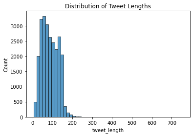
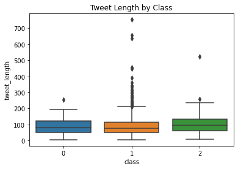
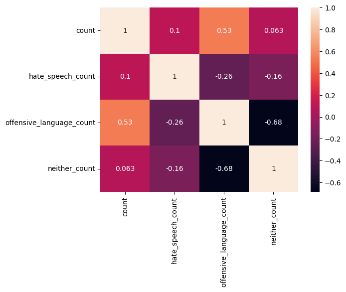
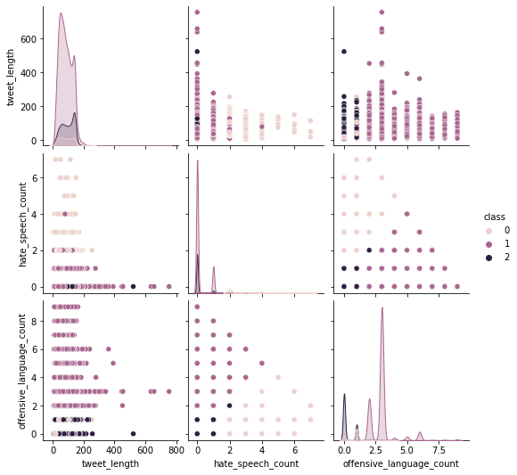

# HATE AND OFFENSIVE LANGUAGE DETECTION

# PROJECT OVERVIEW

Online hate speech and offensive language are increasing on social media, creating hostile environments and negatively affecting mental health. This project aims to develop a machine learning model that accurately detects hate speech and offensive language in tweets. Using a labeled dataset of 24,783 tweets, natural language processing techniques such as tokenization, stopword removal, and vectorization are applied. Supervised learning algorithms, including Logistic Regression and XGBoost, are trained to classify tweets into hate speech, offensive, or neutral categories. The resulting solution can help social media platforms, researchers, and policymakers reduce harmful content, improve user experience, and promote safer online interactions.

# PROBLEM STATEMENT

Online hate speech and offensive language on social media are increasing, exposing users to harmful content and creating hostile environments. Existing moderation methods, both manual and automated, are often slow or inaccurate, leaving a gap in effective detection. This project seeks to address this problem by developing a machine learning model that can automatically identify hate speech and offensive language in tweets, helping platforms maintain safer online communities.

# **OBJECTIVES**

1. To identify linguistic patterns and characteristics associated with harmful content in tweets, including hate speech and offensive language.

2. To classify tweets as harmful or non-harmful .

3. To analyze linguistic feature and trends that distinguish harmful tweets from non-harmful,supporting automated content moderation. 

4. To assess the frequency and distribution of hate speech across the dataset.

# DATA UNDERSTANDING

**1. Dataset Overview**

The dataset contains 24,783 entries and 6 columns.

Each row represents a single tweet along with its classification counts and category.

The dataset is complete; there are no missing values in any column.

**2. Columns Description**
Column Name	Data Type	Description
count	int64	Total count associated with the tweet (context-specific, usually sum of other counts).

hate_speech_count	int64	Count indicating hate speech instances in the tweet.

offensive_language_count	int64	Count indicating offensive language in the tweet.

neither_count	int64	Count of words that are neither hate speech nor offensive.

class	int64	Label representing the type of tweet: 0 = Neutral, 1 = Offensive, 2 = Hate Speech.

tweet	object	The raw text of the tweet.

**3. Data Types and Memory Usage**

Numeric columns: count, hate_speech_count, offensive_language_count, neither_count, class.

Text column: tweet.

Memory usage is approximately 1.1 MB, which is manageable for analysis in pandas.

**4. Initial Observations**

All columns are non-null, so no imputation is required.

The dataset is imbalanced, as there are likely more neutral tweets than hate speech or offensive tweets (this can be confirmed with a class distribution plot).

The tweet column will require text preprocessing (tokenization, stopword removal, etc.) for NLP tasks.

The counts (hate_speech_count, offensive_language_count, neither_count) could be used for feature engineering or exploratory analysis.

# DATA ANALYSIS
**1. Counts per class**

**Interpretation**

The majority of tweets fall into class 1. Depending on common labeling conventions in hate speech datasets (e.g., similar to the popular Davidson et al. dataset), class 1 often represents "offensive language but not hate speech," class 0 "hate speech," and class 2 "neither." The extreme imbalance will make modeling challenging, especially for the minority classes (0 and 2).

**2. Distribution of Tweet Length**

**Interpretation:** 
Most tweets in the dataset are short. The distribution follows what is typical for Twitter data, where users often post concise messages. Longer tweets are rare.

**3.Average tweet length by class**

**Interpretation:** 
Tweet length alone is not strongly discriminative between the classes. All classes contain both short and longer tweets with overlapping distributions. Length is unlikely to be a powerful feature for classification by itself.

**4.Correlation between numeric columns**

**Interpretation:** 
The final class label was likely derived by majority vote or the highest count among the three categories. Offensive language appears to be the most commonly assigned category, while hate speech annotations are less frequent and somewhat distinct from offensive language annotations.

**5.Scatter Plot**

**Interpretation:**

Reinforces that annotation counts are sparse, hate speech votes are rare, and there is no strong systematic relationship between tweet length and annotation patterns.

# DATA MODELING
The model was evaluated using class-wise metrics due to class imbalance.

Evaluation Metrics

Precision

Recall

F1-score

Confusion Matrix

Results Summary
| Class     | Precision | Recall | F1-score |
| --------- | --------- | ------ | -------- |
| Hate      | 0.31      | 0.63   | 0.41     |
| Offensive | 0.97      | 0.85   | 0.90     |
| Neither   | 0.76      | 0.92   | 0.83     |

A visualization of class-wise performance was generated to better understand model behavior.

# CONCLUSIONS

1. The model performs well on Offensive and Neither classes.

2. Performance on the Hate class is comparatively low, indicating difficulty in distinguishing hate speech from offensive language.

3. This suggests overlapping vocabulary and subtle contextual cues in hate speech.

# RECOMMENDATIONS

1. Perform detailed error analysis on misclassified samples.

2. Apply class balancing techniques.

3. Use contextual embeddings (e.g., transformer-based models).

4. Incorporate bias and fairness evaluation.

5. Deploy the model.
